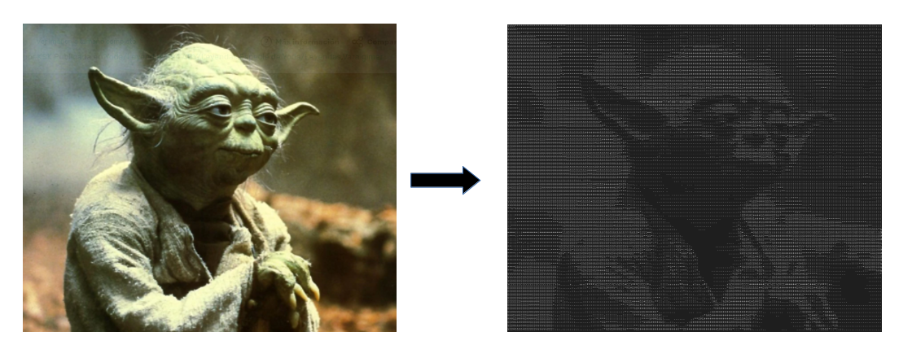

# Image to ASCII art converter
## About
Hello! I built this little streamlit app that transforms any .jpg/.png file to an ASCII image.

The program transforms the image into black and white to get a single color matrix, with values that range form 0 to 255. It will then divide each pixel value by 25 and assign a character based on the density of white pixels, generating a string of text. Finally, it will write the text onto an image. Image can then be saved in 'saved_images' folder.

## How to run
Simply `$ streamlit run main.py` !

## Status
Finished. This app was built just for fun!
